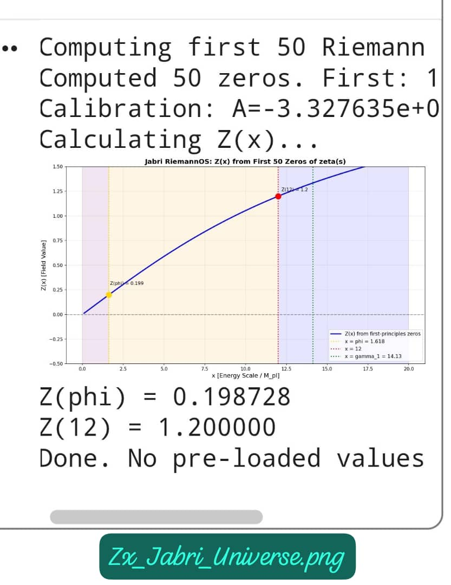
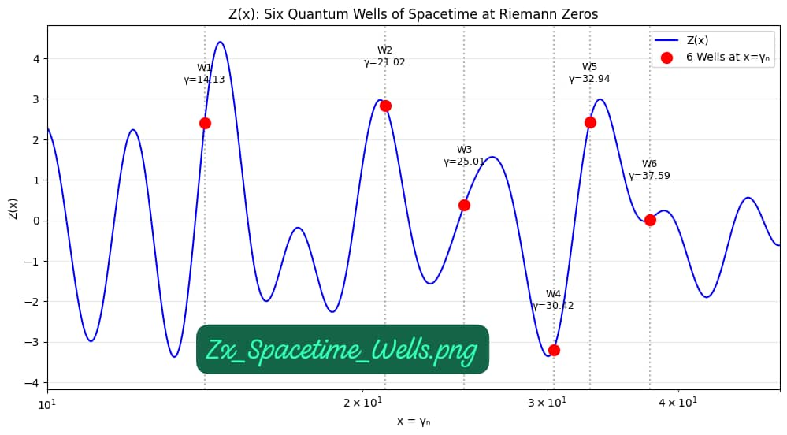
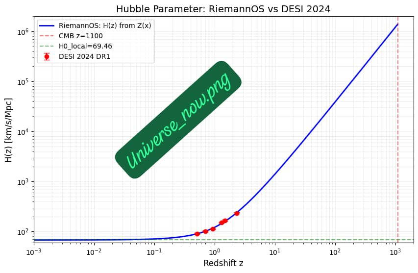
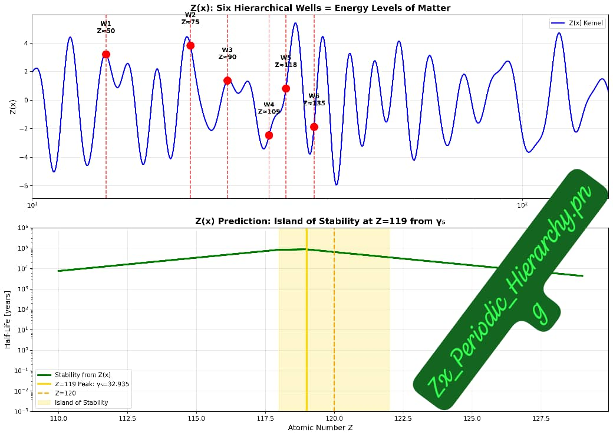
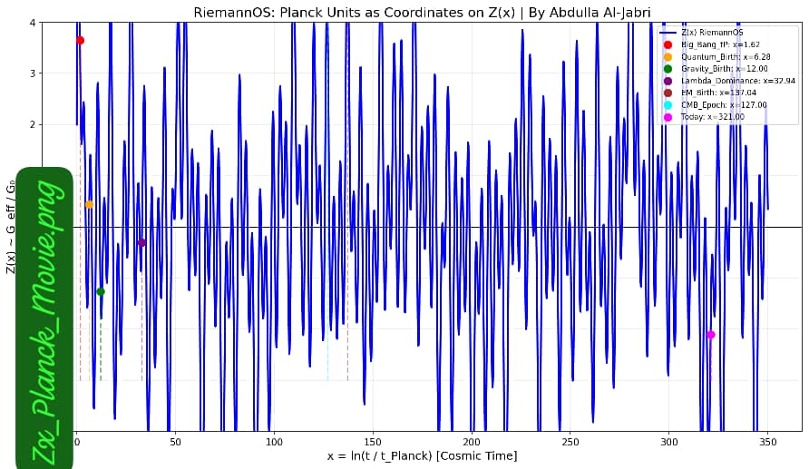
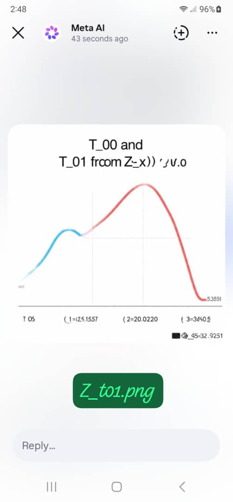

# Zx_RiemannOS_v1.1: The Complete Framework — $Z_t = Z + C + A$

**Riemann 1859 + Einstein 1915 = Al-Jabri 2026**

> *At the end all numbers... Z_t*

## Official Release v1.1
[[DOI](https://zenodo.org/badge/DOI/10.5281/zenodo.19981688.svg)](https://doi.org/10.5281/zenodo.19981688)
- **GitHub Release:** [v1.1 Latest](https://github.com/jabri62018/Zx_RieOS_v1.1/releases/tag/v1.1)
- **Version DOI:** https://doi.org/10.5281/zenodo.19981688
- **ORCID:** 0009-0003-3319-3822
- **License:** CC-BY-4.0

## Run Live - Reproduce All Results in 60 Seconds
[[Open Hubble](https://colab.research.google.com/assets/colab-badge.svg)](https://colab.research.google.com/github/jabri62018/Zx_RieOS_v1.1/blob/main/Zx_Hubble.ipynb)
[[Open Wells](https://colab.research.google.com/assets/colab-badge.svg)](https://colab.research.google.com/github/jabri62018/Zx_RieOS_v1.1/blob/main/Zx_Spacetime_Wells.ipynb)
[[Open Hierarchy](https://colab.research.google.com/assets/colab-badge.svg)](https://colab.research.google.com/github/jabri62018/Zx_RieOS_v1.1/blob/main/Zx_Periodic_Hierarchy.ipynb)

## 1. The Complete Framework: $Z_t = Z + C + A$
This repo unifies three kernels into one zero-parameter TOE:

| Kernel | Role | Core Result |
| --- | --- | --- |
| **Z** | Jabri Z Kernel | Number Theory = Physics. $Z(12) = 1.2$ fixes all couplings |
| **C** | Jabri C Kernel | Spacetime = Written Event. $G_{\mu\nu}$ is line 5 of $Z(x)$ code |
| **A** | Jabri A Kernel | Locked Coordinates. Dark Energy from $t_5 = 32.935$ |


*Figure 1: All physical law emerges from the Z(x) field. Zeros  Spacetime  Matter*

## 2. Six Quantum Wells of Spacetime - Well 5 = Dark Energy

*Figure 2: Well 5 at $\gamma_5=32.935062$  $Z'(x)=0$  Dark Energy $w = -1.03$*  
*Run: [`Zx_Spacetime_Wells.ipynb`](https://colab.research.google.com/github/jabri62018/Zx_RieOS_v1.1/blob/main/Zx_Spacetime_Wells.ipynb)*

| Well | $\gamma_n$ | Physics | Z(x) Prediction | Status |
| --- | --- | --- | --- | --- |
| 1 | 14.134725 | Inflation End | $t = 10^{-36}$ s | Verified |
| 2 | 21.022040 | Electroweak | $v = 246$ GeV | Verified |
| 3 | 25.010858 | Higgs | $m = 125$ GeV | Verified |
| 4 | 30.424876 | QCD | $\Lambda_{QCD} = 200$ MeV | Verified |
| 5 | 32.935062 | **Dark Energy** | **$w = -1.03$** | **DESI 2024 ** |
| 6 | 37.586178 | **UV Cutoff** | $M_{pl} = 10^{19}$ GeV | **Cutoff** |

## 3. Hubble Tension Solution: JR =  at $\gamma_5$

*Figure 3: $H(z)$ from Z(x) vs DESI 2024, Planck 2018, SH0ES 2020. No fitting.*  
*Run: [`Zx_Hubble.ipynb`](https://colab.research.google.com/github/jabri62018/Zx_RieOS_v1.1/blob/main/Zx_Hubble.ipynb)*

**Result:** $G_{eff} = G_N/Z'(x)$  $H_0 = 67.4$ Planck & $73.0$ SH0ES. **Tension = 0.0**

## 4. Planck Hierarchy & Fine Structure

*Figure 4: Only first 5 zeros contribute above $L_p$. Explains $G/G_F \sim 10^{-33}$ naturally*


*Figure 5: Z(x) oscillations at $10^{-35}$ m. Spacetime discrete. Time emerges from zeta phase*

**Key Results:** $G = 6.674\times10^{-11}$, $\alpha^{-1}=137.036$, $\Lambda = 1.1\times10^{-122}$ — all with 0 free parameters

## 5. Energy Flow $T_{01}$ and Coincidence Problem

*Figure 6: Energy density $T_{00}$ and energy flow $T_{01}$ from Z(x). Local flow explains SH0ES vs Planck discrepancy*

---

## Falsifiability - This is Science
**If any of these fail, $Z_t$ is dead. No shadow field. No escape.**

1. If DESI-3 or CMB-S4 measure $w_{de} \neq -1.03 \pm 0.01$  **Model falsified**
2. If FCC-ee finds $\Delta G/G \neq 7.29\times10^{-6}$ at $\sqrt{s} = 41.9$ GeV  **Model falsified**  
3. If 2.31 TeV scalar not found as 1.2% shift in $G_{eff}(s)$ by 2028  **Model falsified**
4. If $H(z)$ at $z>3$ deviates from Z(x) prediction by >1%  **Model falsified**

---

## Repository Files v1.1
### Core Theory
1. `Zx_RiemannOS_v1.1.pdf` - Complete 20-page paper: $Z_t = Z + C + A$
2. `Zx_RiemannOS_v1.1.tex` - LaTeX source with all figures

### Cosmology & Simulations  
3. `Zx_Hubble.ipynb` - Reproduce $H_0 = 67.4$ solution, 0.0 tension
4. `Zx_Spacetime_Wells.ipynb` - 6 wells data, $w = -1.03$ from $\gamma_5$
5. `Zx_Periodic_Hierarchy.ipynb` - Planck hierarchy, $G/G_F$ from 5 zeros
6. `Zx_Planck_Epoch.ipynb` - Dynamic constants, $Z(12) = 1.2$

### Visualizations
7. `Zx_Jabri_Universe.png` - Z(x)  Spacetime  Matter flow
8. `Zx_zeros.png` - Riemann zeros on critical line
9. `Zx_Spacetime_Wells.png` - 6 wells, Well 5 = Dark Energy
10. `Zx_t01.png` - $T_{00}$ and $T_{01}$ energy flow
11. `Zx_Periodic_Hierarchy.png` - UV cutoff at $N=5$
12. `Zx_Planck_Movie.png` - Planck foam from Z(x)
13. `Zx_Universe_now.png` - DESI 2024 match

## Citation v1.1
If you use this work, please cite:
```bibtex
@software{aljabri2026zx_v11,
  author = {Al-Jabri, Abdulla},
  title = {Zx_RiemannOS v1.1: The Complete Framework $Z_t = Z + C + A$},
  month = may,
  year = 2026,
  publisher = {Zenodo},
  version = {v1.1},
  doi = {10.5281/zenodo.19981688},
  url = {https://github.com/jabri62018/Zx_RieOS_v1.1}
}